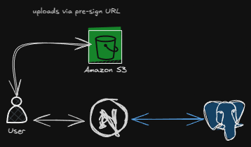

# Instagram Clone - Next.js



## Overview
This is a full-featured social media application built using Next.js. It leverages PostgreSQL for data storage and AWS S3 for media management. The application can be set up manually or using Docker Compose for a streamlined experience.

## Prerequisites
Before setting up the project, ensure you have the following installed:
- Node.js (latest LTS version recommended)
- PostgreSQL (running instance required)
- AWS S3 bucket (for media storage)
- Docker (if using the Docker-based setup)

## Installation & Setup

### Manual Setup
1. **Clone the Repository**
   ```sh
   git clone https://github.com/sidharthtripathi/instagram-nextjs
   ```
2. **Navigate into the Project Directory**
   ```sh
   cd instagram-nextjs
   ```
3. **Install Dependencies**
   ```sh
   npm install
   ```
4. **Set Up Environment Variables**
   - Copy `.env.example` to `.env`
   - Configure PostgreSQL and AWS S3 settings accordingly
   
5. **Initialize the Database**
   ```sh
   npm run db:init
   ```
6. **Start the Development Server**
   ```sh
   npm run dev
   ```
   The application will now be accessible at `http://localhost:3000`.

### Docker-Based Setup
1. **Set Up the Environment Variables**
   - Copy `.env.example` to `.env` and configure it properly.

2. **Start All Services Using Docker Compose**
   ```sh
   docker-compose up -d
   ```
   This will launch the application along with the required services.

